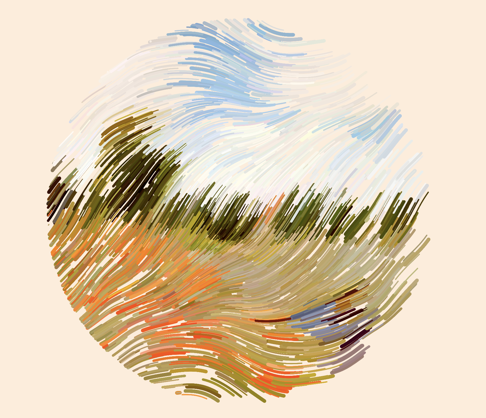
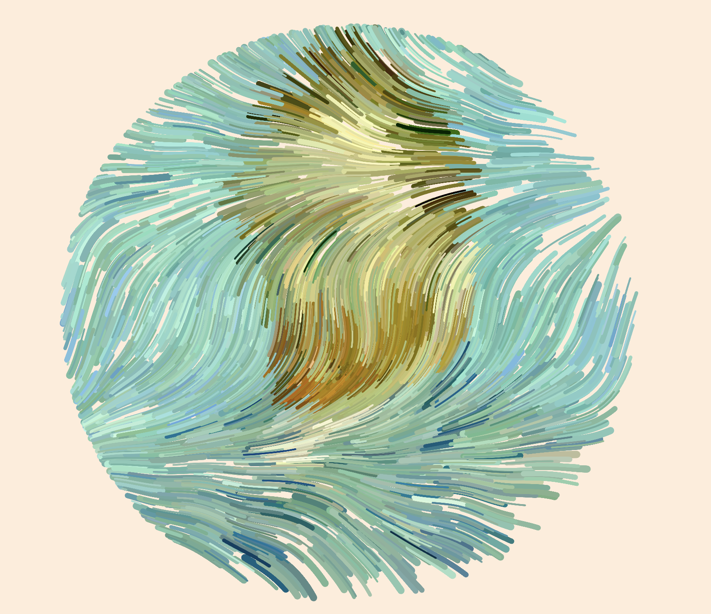
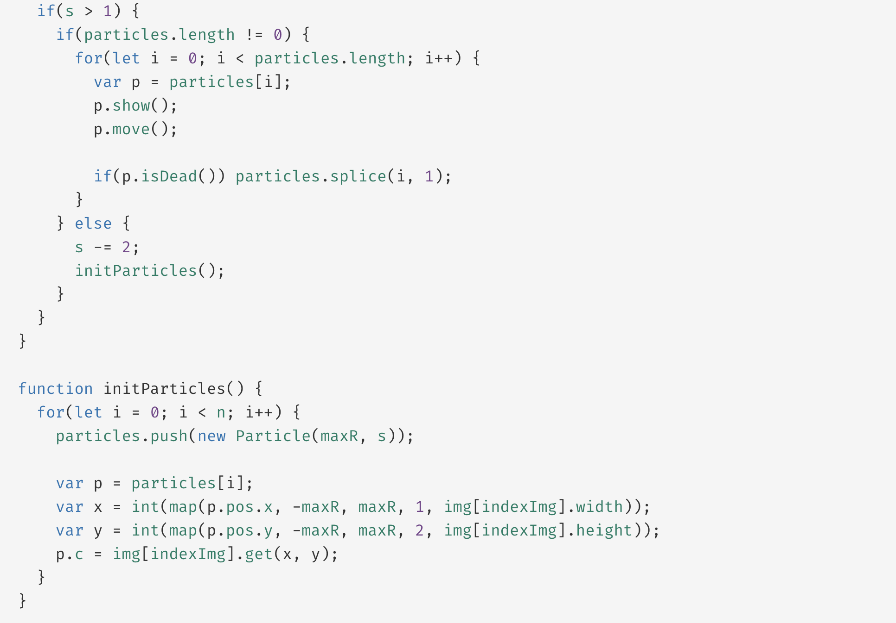
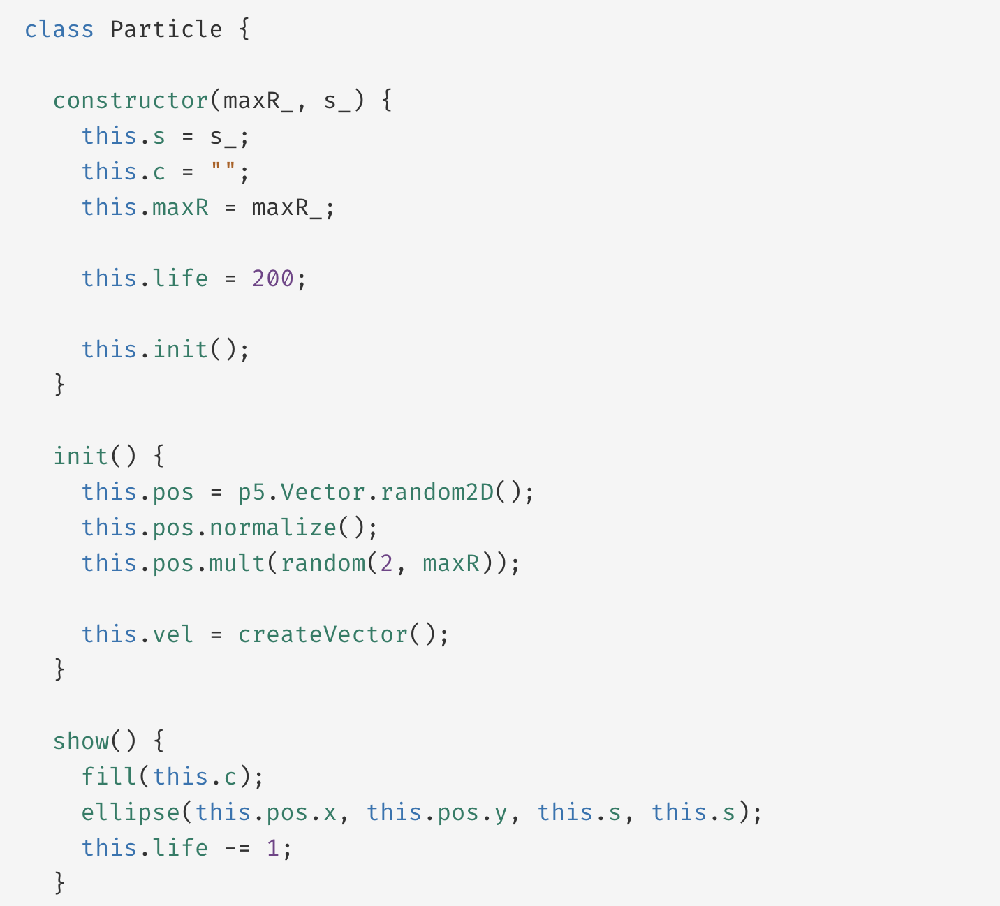
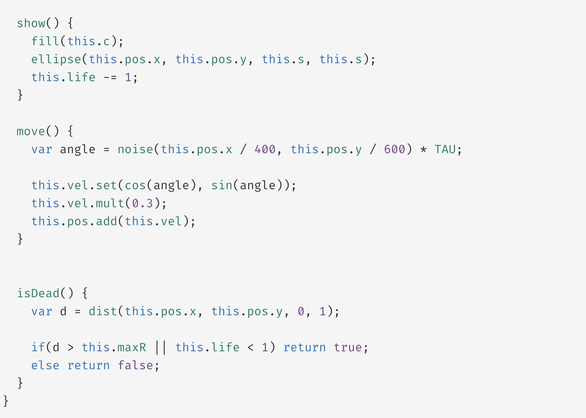

# kfar0017_9103_tut1
# **Imaging Technique**

I find this imaging technique inspiring because it mimics the way we paint an image on real canvas. We need to wait for particles to complete the pattern to see the whole picture, which for me quite intriguing to see how will the end results be like, and produce a surprising elements throughout the process until the end.

# **Coding Technique**
[Code link](https://openprocessing.org/sketch/1859416)

This p5.js sketch builds a particle system that produces abstract art by moving particles on a canvas. The particle system is reset and images are switched when you click the mouse. The particles move according to noise and produce dynamic patterns. The colours of the particles are sampled from the imported images, and the code builds a Particle class to control the behaviour of each individual particle.
